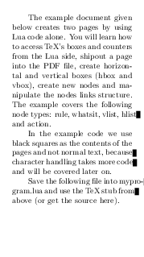
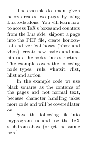

# The `Linebreaker` package

Purpose of this experimental package is to prevent paragraph overflow in
LuaTeX. Sometimes, TeX cannot find good points for line-breaking. This results
in lines where part of words stick out of the paragraph shape. `Linebreaker`
tries to prevent that using repeated execution of the line-breaking algorithm
with different values for parameters which are taken into account in this
process.

## Usage

     \usepackage{linebreaker}

## Example

<table>
<tr>
<td></td>
<td></td>
</tr>
<tr><td>Without `linebreaker`</td><td>With `linebreaker`</td></tr>
</table>

## Some background

This repository contains experimental line-breaking callback for LuaTeX engine (
it should work with any format). Motivation for this was a
[question](http://tex.stackexchange.com/q/200989/2891) by Frank Mittelbach on
TeX.sx. His idea is to rewrite TeX paragraph building algorithm in Lua, in
order to support river detection and similar tasks, unsupported by standard TeX
line-breaking algorithm.

As complete rewrite of line-breaking algorithm seems to be huge task, I tried
different approach. LuaTeX provides several callbacks for working with node lists. 
There callbacks are called when some actions on the node lists happens. For
example ligaturing, kerning, before line-breaking, after line-breaking and
callback for doing the line-breaking. There is a `tex.linebreak` function, which takes
node list and table with TeX parameters (`lineskip`, `baselineskip`, `tolerance`,
etc.) New node list with lines broken into horizontal boxes is returned by this
function.

My idea is to process this returned node list, detect problems and call
`tex.linebreak` with different parameters if problems were detected. At the
moment, overflow box detection works somehow, river detection is a proof of
concept and it needs further corrections.

